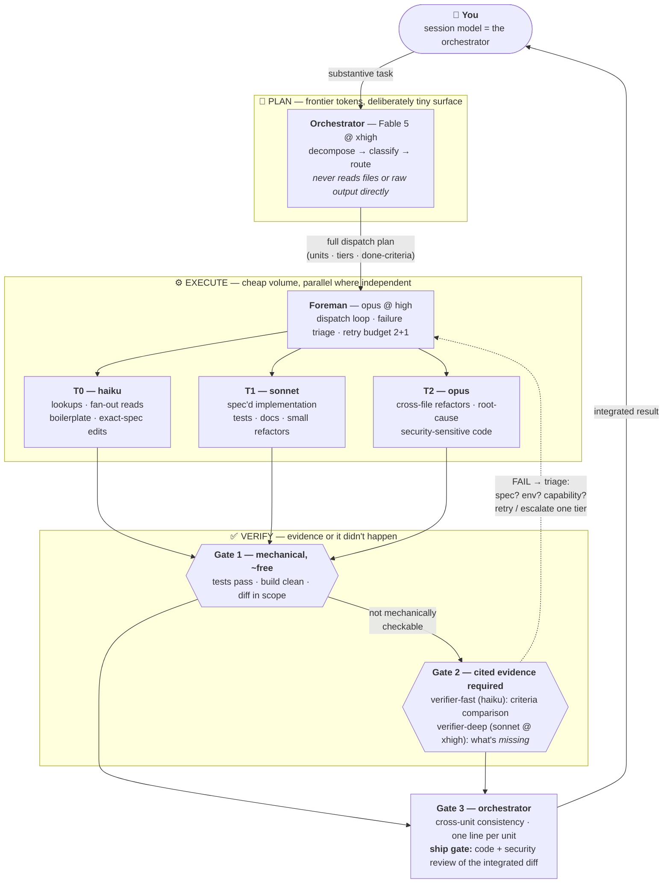

# claude-orchestrate

**Multi-agent orchestration for coding agents.** Your frontier model plans, routes, and verifies; cheap workers do the volume. Every unit of work is routed to the cheapest model that can reliably do it, checked by evidence-gated verification (a sub-agent's "done!" is never trusted), and escalated only on genuine capability failures — under hard per-unit retry budgets and a global dispatch cap.

Ships as a first-class **[Claude Code](https://claude.com/claude-code) plugin**, plus a **[portable edition](portable/orchestrator.md)** for every other agent — OpenAI Codex (ChatGPT app, CLI, IDE, web), opencode, Cursor, Gemini CLI, GitHub Copilot, Aider, and anything else that reads repo instructions. See [Using it outside Claude Code](#using-it-outside-claude-code).

## 🚀 Install

In Claude Code, run:

```
/plugin marketplace add midego1/claude-orchestrate
/plugin install orchestrate@claude-orchestrate
```

Start a **new session** (plugins load at session start) and verify the `orchestrate` skill and the `foreman` / `verifier-fast` / `verifier-deep` agents appear. Then set up the [ideal model configuration](#%EF%B8%8F-ideal-setup-which-model-to-select-in-claude-code) and try it: `/orchestrate <a substantive task>`.

> This repo is itself a [plugin marketplace](https://code.claude.com/docs/en/plugin-marketplaces) — Claude Code's plugin system is decentralized, so the two commands above are all anyone needs. No central registry involved.

> **Ops tip:** pre-approve your test/build/lint commands (and safe MCP tools) in `.claude/settings.json` permissions. Gate 1 runs them constantly — permission prompts are what stall an otherwise autonomous loop.

**Team-wide, per repo** — add to your repo's `.claude/settings.json` so everyone gets it automatically:

```json
{
  "extraKnownMarketplaces": {
    "claude-orchestrate": {
      "source": { "source": "github", "repo": "midego1/claude-orchestrate" }
    }
  },
  "enabledPlugins": {
    "orchestrate@claude-orchestrate": true
  }
}
```

**Manual copy** — copy `skills/orchestrate/` into your repo's `.claude/skills/` and `agents/*.md` into `.claude/agents/`.

**Recommended: activation nudge in CLAUDE.md** — skill triggering is model behavior (description-based), not a hard guarantee; this one-liner makes it far more reliable (`CLAUDE.md` is read at the start of every session):

```markdown
## Orchestration

For substantive multi-unit tasks (>~3 independent units, multi-file changes,
or work that benefits from parallel workers), use the `orchestrate` skill.
Trivial turns and single-file fixes: work directly, no orchestration.
```

**Not using Claude Code?** See [Using it outside Claude Code](#using-it-outside-claude-code).

---

## ⚡ When does it activate?

**Automatically**, when your task is substantive:

- decomposes into **more than ~3 independent units**, or
- spans **multiple files or subsystems**, or
- benefits from **parallel workers** (features, migrations, audits, large refactors, multi-bug sweeps).

It deliberately stays **out of the way** on trivial turns — single-file fixes, quick lookups, conversational questions. Those are faster done directly, and the skill's description tells the model exactly that.

**Manually**, any time:

```
/orchestrate <your task>
```

e.g. `/orchestrate migrate all 40 API routes to the new error-handling pattern`

> **Tip — make auto-activation far more reliable:** skill triggering is model behavior (description-based), not enforced by the manifest. Add a one-line rule to your repo's `CLAUDE.md` (see [Install](#-install)) and the orchestrator fires consistently on substantive tasks. Guaranteed activation is always one `/orchestrate` away.

## 🎛️ Ideal setup: which model to select in Claude Code

The model you select in Claude Code **is the orchestrator** — it does the decomposition, routing, escalation judgment, and final integration. The workers don't change with your selection (their models are pinned per dispatch), so this choice is purely about the quality of the *judgment* at the top.

| Setting | Recommended | Why |
|---|---|---|
| **Session model** | **Fable 5** (`/model claude-fable-5`) | The orchestrator's whole job is judgment: decomposition quality determines everything downstream. A bad plan at the top causes escalation cascades below. |
| **Reasoning effort** | **`xhigh`** — labeled **"Extra"** in the desktop app's effort menu | Deep reasoning over a deliberately *small* token surface — the orchestrator never reads files or raw logs, so you pay frontier prices only for planning. See [Which effort, when?](#which-effort-when) for `xhigh` vs `ultracode` vs `max`. |
| **Claude Code version** | **≥ 2.1.172** | Nested sub-agents: the foreman must dispatch workers of its own. |

Running Opus or Sonnet as the session model works too — the protocol is model-agnostic — but plan quality, and therefore total cost, degrades: weaker decomposition means more retries and escalations below.

### Which effort, when?

Naming differs per surface: the CLI and settings call it `xhigh`; the **desktop app's effort menu labels it "Extra"**. Same thing. `max` and `ultracode` are session-only — they can't be set persistently in `settings.json`, so pick them per session.

| Setting | What it is | Pick it when |
|---|---|---|
| `high` (default) | Balanced reasoning | Everyday single-focus work; you're not orchestrating |
| `xhigh` / **"Extra"** | Deeper reasoning, higher token spend | **Orchestrator sessions with this plugin** — decomposition, routing, and triage are pure judgment over a small token surface. Also: unknown-root-cause debugging, design trade-offs, security review |
| [`ultracode`](https://code.claude.com/docs/en/workflows) | `xhigh` **plus** standing permission for Claude Code's native multi-agent workflows (Claude Code ≥ 2.1.203, session-only) | You want fan-out on *every* substantive task without being asked each time — audit days, migration sweeps, "be exhaustive" work. Composes with this plugin: ultracode supplies the engine, the protocol supplies the discipline. Heaviest spend of the menu |
| `max` | Absolute maximum, no token constraints | Rarely — one hardest problem, single dispatch. Prone to overthinking; never for routine work or as a session default |

Rule of thumb: **`xhigh`/Extra is the sweet spot for this plugin.** Step up to `ultracode` for a session when you know the whole day is substantive multi-unit work; step down to `high` when you're just chatting with the codebase.

---

## What it does

Given a substantive task, the orchestrator:

1. **Decomposes** it into independent units, each with explicit inputs, outputs, and machine-checkable done-criteria.
2. **Classifies** each unit into a complexity tier (T0–T3) and announces the routing plan as one compact table — before spending anything.
3. **Hands execution to a foreman** (an Opus sub-agent) that dispatches workers in parallel, runs verification gates, triages failures, and manages retries — without the expensive top model in the loop. (Plans of ≤3 units skip the foreman; the orchestrator runs the loop and the gates itself.)
4. **Verifies everything through gates.** Mechanical checks first (tests, builds, grep invariants — free), then cheap verifier agents that must cite evidence. A verdict without evidence is a FAIL.
5. **Escalates only real capability failures** — after triage rules out bad specs and broken environments — one tier at a time, capped at 2 attempts + 1 escalation per unit.
6. **Integrates** gate-passed results, checks cross-unit consistency, runs a final **ship gate** — automated code review plus security review over the integrated diff — and ships.

The net effect: frontier-quality output at a fraction of frontier cost, with failure containment built in.

## How it works



### The three ideas that carry the design

**1. Failure triage before escalation.** Most sub-agent failures are *not* capability failures. The foreman triages in strict order:

| Failure type | Meaning | Response |
|---|---|---|
| **Spec failure** | Ambiguous criteria, missing context, wrong assumption in the dispatch | Rewrite the dispatch, retry **same** tier — escalating a bad spec buys an expensive wrong answer |
| **Environment failure** | Flaky test, missing dep, wrong branch, stale state | Fix the environment, retry same tier |
| **Capability failure** | Spec was correct and complete; the model genuinely couldn't do it | Escalate **one** tier (effort first, then model), passing the failed attempt along |

Hard cap: **2 attempts + 1 escalation per unit**, then the unit is surfaced to you with its full failure history. No escalation ladders, ever.

**2. Evidence-gated verification.** No sub-agent's self-report of success is ever trusted — and that includes summaries: every PASS travels with a reference to its evidence (the command + exit code, or where the verdict lives), archived per run under `.claude/orchestrate-runs/`. Verifiers must return PASS/FAIL *per criterion* with cited evidence — specific test output, line numbers, diff hunks. "Looks correct" is a FAIL. The deep verifier additionally reports what is **missing** relative to the spec (dedicated `MISSING` lines): unhandled edge cases, symptom patches masquerading as root-cause fixes, semantically inequivalent rewrites.

**3. Orchestrator token conservation.** Everything the top model reads stays in its context and is re-processed every subsequent turn. So the orchestrator never reads files (readers summarize instead — haiku for targeted extraction, sonnet for open-ended comprehension), every dispatch caps its return size, failure histories arrive compressed, and planning happens in one pass rather than dispatch-look-dispatch loops.

### Model routing

| Tier | Model | Use for |
|---|---|---|
| **T0 — Mechanical** | haiku | Lookups, grep-style exploration, fan-out reads, renaming, formatting, boilerplate, exact-spec single-file edits, criteria verification |
| **T1 — Standard** | sonnet | Implementation from a clear spec, tests, known-root-cause bug fixes, docs, 1–3 file refactors, open-ended comprehension reads |
| **T2 — Complex** | opus | Cross-file refactors, root-cause investigation of non-obvious bugs, critical-path review, migration planning, concurrency logic, security-sensitive code |
| **T3 — Frontier** | fable | Rare: units needing long autonomous investigation with unclear constraints — usually the orchestrator itself is the frontier tier and T2 suffices below it |

Key heuristics (full set in [`SKILL.md`](skills/orchestrate/SKILL.md)):

- Spec so precise it's mechanically checkable → **drop a tier**.
- Wrong answer expensive to detect → **route up** rather than rely on retry.
- **Reader split:** targeted questions ("what does X do?") → haiku; open questions ("how does this subsystem work?") → sonnet. Haiku's failure mode as a reader is *silent omission* — the expensive kind.
- Target distribution: ~60% T0/T1, ~35% T2, ≤5% T3. Heavier than that → the decomposition is wrong, not the models.

### Reasoning depth

Effort is a second, cheaper lever than model choice — Sonnet at `xhigh` often matches Opus at `high` for a fraction of the cost.

| Depth | When |
|---|---|
| low | Fully-specified, mechanically checkable output |
| medium | Cost-sensitive standard work where a rare miss is cheap to catch |
| **high** (default) | Normal implementation and analysis |
| xhigh | Debugging without a known cause, design trade-offs, security/correctness review |
| max | Last resort, single hardest unit only — prone to overthinking |

## What's inside

| Component | Model / effort | Role |
|---|---|---|
| [`skills/orchestrate`](skills/orchestrate/SKILL.md) | (loads into your session) | The full protocol: decomposition, routing tables, gates, triage rules, dispatch contract, budget discipline |
| [`agents/foreman`](agents/foreman.md) | opus @ high | Execution manager: dispatch loop, gates, triage, retries, escalation ledger |
| [`agents/verifier-fast`](agents/verifier-fast.md) | haiku | Gate 2: PASS/FAIL per done-criterion, evidence required |
| [`agents/verifier-deep`](agents/verifier-deep.md) | sonnet @ xhigh | Gate 2 for judgment calls: also reports what's *missing* vs. the spec (`MISSING` lines) |
| [`scripts/check-update.sh`](scripts/check-update.sh) + [`hooks/hooks.json`](hooks/hooks.json) | (shell, SessionStart) | Update notifier: tells you when a newer version exists and why it matters — never installs anything ([details](#updates)) |

## Where this fits

This protocol deliberately implements the practices from Boris Cherny's [*Steps of AI Adoption*](https://claude.ai/code/artifact/bfdfaef9-bc62-4dfe-ba9e-c58a26c9accf) (Jul 2026; claude.ai sign-in required) — a maturity model from step 0 (gated) to step 4 (AI-native, ~1,000+ agents). On that curve: step 1 is you pair-programming with one agent; step 2 is one engineer orchestrating ~10 parallel agents; step 3 is supervised autonomy — a *manager of managers*, where Claude kicks off Claude. This plugin is the **step 2 → 3 bridge**: the foreman pattern *is* "let Claude kick off Claude", wrapped in the discipline — tiered routing, evidence gates, failure triage, hard budgets — that makes a deeper agent tree trustworthy. Trust in the loop is the exact bottleneck that stalls teams between those steps.

Practices adopted directly from the model: a self-verification loop you can trust (Gate 1: tests + build + lint + e2e), automated code review and security review before shipping (the ship gate), worktree isolation so parallel agents don't collide, "what context was the model missing?" as the failure question (the escalation ledger feeding `CLAUDE.md`/skills), and encoding standards as lazily-loaded skills rather than an ever-growing `CLAUDE.md`.

## Using it outside Claude Code

The protocol is model- and agent-agnostic; only the plumbing (pinned sub-agent models, effort frontmatter, `/orchestrate`) is Claude Code-specific. The **[portable edition](portable/orchestrator.md)** expresses routing as capability tiers (T0–T3) you map onto any provider's lineup, and includes fallbacks for agents missing primitives (no nested sub-agents, no per-dispatch model choice, no parallelism).

| Agent | Where to put it |
|---|---|
| **OpenAI Codex** (ChatGPT app, CLI, IDE extension, web) | Paste [`portable/orchestrator.md`](portable/orchestrator.md) into `AGENTS.md` in your repo root — all Codex surfaces read the same file |
| **opencode** | `AGENTS.md`; optionally register the appendix role prompts as custom agents in `.opencode/agent/` |
| **Cursor** | `.cursor/rules/orchestrator.mdc` (or `AGENTS.md` in recent versions) |
| **Gemini CLI** | `GEMINI.md` |
| **GitHub Copilot** (agent mode) | `.github/copilot-instructions.md` |
| **Aider** | `CONVENTIONS.md` |
| **Anything else** | Wherever your agent reads repo-level instructions |

What degrades gracefully: agents without nested sub-agents run the foreman loop themselves; agents without per-dispatch model selection keep the tier discipline as a *reasoning-depth* discipline; agents without parallelism execute units sequentially, cheap fan-out first. The core — decompose → machine-checkable done-criteria → evidence gates → failure triage → hard retry budget — survives everywhere.

## Security

- **No secrets, by design:** the repo contains only prompts, manifests, and one read-only shell script — no credentials, endpoints, or tokens. The protocol never asks an agent to expose or exfiltrate credential values; code that touches them is routed up-tier and ship-gated instead.
- **[gitleaks](https://github.com/gitleaks/gitleaks) CI** scans the full git history on every push and PR ([workflow](.github/workflows/gitleaks.yml)).
- **GitHub secret scanning + push protection** are enabled on this repo, so a leaked credential blocks the push before it lands.

## Updates

**The plugin never updates itself.** Two layers, both under your control:

1. **Claude Code's built-in mechanism**: third-party marketplaces default to auto-update *disabled* — you update explicitly via `/plugin` → Manage (or `claude plugin update orchestrate@claude-orchestrate`, then `/reload-plugins`). You can opt into auto-update per marketplace in `/plugin` → Marketplaces if you prefer.
2. **The update notifier** ([`scripts/check-update.sh`](scripts/check-update.sh), wired to a `SessionStart` hook): at most once per 24h it compares your installed version against this repo and, when a newer release exists, prints a notice with the version jump, the changelog's **"Why update"** line for that release, a link to the [full changelog](CHANGELOG.md), and the exact update command. It is read-only and fail-silent — no network, no notice, no breakage. It never installs anything.

Every release in [CHANGELOG.md](CHANGELOG.md) carries a one-line *Why update* so you can decide in five seconds whether it matters to you.

## Runtime artifacts

Two artifacts appear in **your** repo when orchestrating:

- **`.claude/escalation-ledger.md`** — every escalated or surfaced unit (`unit | initial tier | failure type | final tier | outcome`), created on first use. This is the system's feedback loop: it shows where the routing table is mis-calibrated. If more than a third of units escalate in a session, the decomposition or the specs are the problem — not the models.
- **`.claude/orchestrate-runs/<timestamp>/`** — the run archive: raw worker logs, gate outputs, and failure histories land here, referenced (not inlined) in what flows back to the orchestrator. This is how PASS lines stay one-line *and* auditable. Gitignore it if you don't want run logs in history.

## FAQ

**Does this cost more than just doing the work directly?**
For trivial tasks, yes — which is why it doesn't trigger on them. For substantive tasks it's cheaper *and* better: the volume runs on haiku/sonnet instead of your frontier model, and the gates catch plausible-but-wrong output before it compounds.

**What if a worker claims success but is wrong?**
That's the core design case. Claims of success without gate evidence are FAILs by definition. Gate 1 runs the actual tests; Gate 2 verifiers must cite evidence per criterion.

**Can I use this without Fable 5?**
Yes — any session model works. You lose orchestration judgment quality, which shows up as more retries and escalations downstream, not as a hard failure.

**Why is the orchestrator forbidden from reading files?**
Its context compounds: everything it reads is re-processed on every later turn of the session. Readers return scoped summaries instead, so frontier tokens are spent on judgment, not on I/O.

**How does this relate to Claude Code's built-in `ultracode` mode?**
They compose. [`ultracode`](https://code.claude.com/docs/en/workflows) (the keyword, or `/effort ultracode` for a session) is native Claude Code machinery: it runs at `xhigh` effort and grants standing permission to launch multi-agent workflows — the *fan-out engine*. It doesn't prescribe *how* to spend that fan-out. This plugin supplies the discipline on top: cost-tiered model routing, evidence-gated verification, failure triage, and a hard retry budget. (Related but different: [`ultrathink`](https://code.claude.com/docs/en/model-config#adjust-effort-level) is a prompt keyword for one-off deeper reasoning on a single turn — the dispatch contract in this protocol uses it to request depth on individual sub-agent dispatches.)

## License

[MIT](LICENSE)
