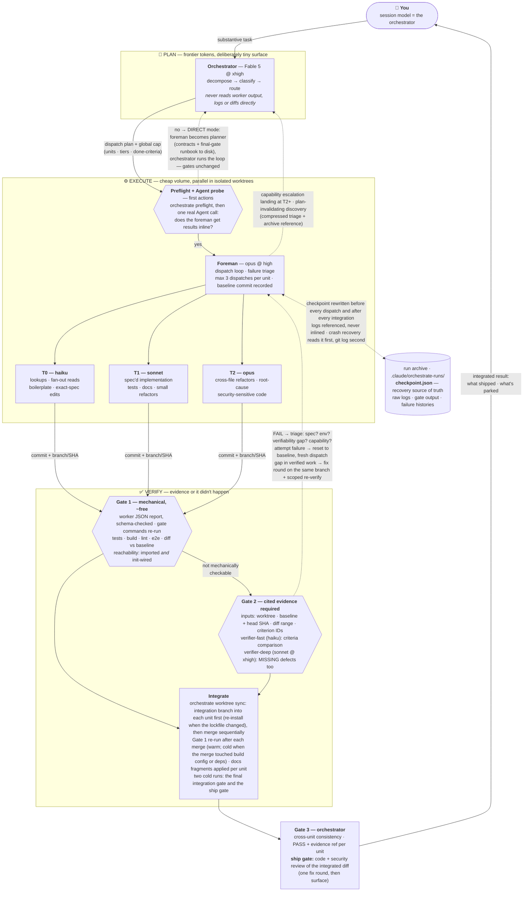

# claude-orchestrate

**Multi-agent orchestration for coding agents.** Your frontier model plans, routes, and verifies; cheap workers do the volume. Every unit of work is routed to the cheapest model that can reliably do it, checked by evidence-gated verification (a sub-agent's "done!" is never trusted), and escalated only on genuine capability failures — under hard per-unit retry budgets and a global dispatch cap.

Ships as a first-class **[Claude Code](https://claude.com/claude-code) plugin**, plus a **[portable edition](portable/orchestrator.md)** for every other agent — OpenAI Codex (ChatGPT app, CLI, IDE, web), opencode, Cursor, Gemini CLI, GitHub Copilot, Aider, and anything else that reads repo instructions. See [Using it outside Claude Code](#using-it-outside-claude-code).

## 🚀 Install

In Claude Code, run:

```
/plugin marketplace add midego1/claude-orchestrate
/plugin install orchestrate@claude-orchestrate
```

Start a **new session** (plugins load at session start) and verify the `orchestrate` skill and the `foreman` / `verifier-fast` / `verifier-deep` agents appear. Then set up the [ideal model configuration](#%EF%B8%8F-ideal-setup-which-model-to-select-in-claude-code), read [Setup](#setup) (one env flag for foreman runs, the preflight, the optional gates manifest) and try it: `/orchestrate <a substantive task>`.

> This repo is itself a [plugin marketplace](https://code.claude.com/docs/en/plugin-marketplaces) — Claude Code's plugin system is decentralized, so the two commands above are all anyone needs. No central registry involved.

> **Ops tip:** pre-approve your test/build/lint commands (and safe MCP tools) in `.claude/settings.json` permissions. Gate 1 runs them constantly — permission prompts are what stall an otherwise autonomous loop.

**Team-wide, per repo** — add to your repo's `.claude/settings.json` so everyone gets it automatically:

```json
{
  "extraKnownMarketplaces": {
    "claude-orchestrate": {
      "source": { "source": "github", "repo": "midego1/claude-orchestrate" }
    }
  },
  "enabledPlugins": {
    "orchestrate@claude-orchestrate": true
  }
}
```

**Manual copy** — clone this repository (or copy `bin/`, `schemas/`, `templates/`, `scripts/` and `hooks/` alongside `skills/orchestrate/` into `.claude/skills/` and `agents/*.md` into `.claude/agents/`). The skill runs `"<plugin root>/bin/orchestrate"` for every state change and copies `templates/*.md` and `schemas/*.json` by path, so a copy of only the skill and the agents does not work: in that session, `orchestrate` means `"<checkout>/bin/orchestrate"` (the `${CLAUDE_PLUGIN_ROOT}` placeholder the hooks use is set only for plugin installs). The `SubagentStart` / `SubagentStop` / `PreToolUse` / `Stop` hooks are active only with a plugin install unless you merge [`hooks/hooks.json`](hooks/hooks.json) into your project's settings by hand.

**Recommended: activation nudge in CLAUDE.md** — skill triggering is model behavior (description-based), not a hard guarantee; this one-liner makes it far more reliable (`CLAUDE.md` is read at the start of every session):

```markdown
## Orchestration

For substantive multi-unit tasks (>~3 independent units, multi-file changes,
or work that benefits from parallel workers), use the `orchestrate` skill.
Trivial turns and single-file fixes: work directly, no orchestration.
```

**Not using Claude Code?** See [Using it outside Claude Code](#using-it-outside-claude-code).

## Setup

Two kinds of run exist, and only one of them needs configuration. Plans of 5 units or fewer run in **direct mode**: the orchestrator dispatches from your main session, which may run children in the foreground or the background, so none of the environment flags below are required. Plans of 6 or more units hand the loop to the **foreman** sub-agent, and the foreman must get every worker and verifier result back inline, in the foreground, before it ends its turn. That is not the harness default, so foreman runs need one `env` entry in the project's `.claude/settings.json` (or in `.claude/settings.local.json` if you do not want to commit it):

```json
{
  "env": {
    "CLAUDE_CODE_DISABLE_BACKGROUND_TASKS": "1"
  }
}
```

The facts behind that, verified against the Claude Code docs on 2026-09-09 ([sub-agents](https://code.claude.com/docs/en/sub-agents), [hooks](https://code.claude.com/docs/en/hooks), [environment variables](https://code.claude.com/docs/en/env-vars)):

- **`CLAUDE_CODE_DISABLE_BACKGROUND_TASKS=1`** (preferred) runs every sub-agent in the foreground in every kind of session, whether or not fork mode is on. It is the one deterministic switch. It also disables `run_in_background` on Bash, auto-backgrounding and the Ctrl+B shortcut for that project, which is why it belongs in the project's settings and not in `~/.claude/settings.json`.
- **`CLAUDE_CODE_FORK_SUBAGENT=0`** is the alternative. Fork mode is on by default in interactive sessions since Claude Code 2.1.232; while it is on, every sub-agent runs in the background and the docs say the Agent tool's `run_in_background` parameter is removed from the tool schema; on some versions (the 2.1.260 probe) it is still present and honored, so it is never sufficient alone and the foreman's probe decides. Setting the variable to `0` turns fork mode off in every kind of session and brings the parameter back, but background stays the default: the foreman must pass `run_in_background: false` on every dispatch, and only its Agent probe (below) proves that the harness honored it. The trade-off: Bash backgrounding keeps working, and dispatch mode is checked at run time instead of being guaranteed by configuration. Use one flag or the other.
- **`CLAUDE_CODE_MAX_SUBAGENT_SPAWN_DEPTH`** must stay at 2 or higher. The default is 3 (Claude Code 2.1.219 and later; 2.1.217 and 2.1.218 defaulted to 1). The foreman sits one layer below your session and its workers one layer below that; at depth 1 the foreman has no Agent tool and the preflight refuses the foreman layer. Never set it to 1 in a repo you orchestrate in.
- **`CLAUDE_CODE_SUBAGENT_MODEL_FORCE=1`** (Claude Code 2.1.257 and later) makes the harness ignore the `model` field of every sub-agent definition and any model passed per dispatch. Tiered routing then fails silently: haiku sweeps, sonnet workers and opus units all run on one model, and the cost line is wrong. Leave it unset; the preflight refuses to run while it is on, in both modes.

**Preflight.** Before the first run in a repo, and whenever you change these settings, run the harness check:

```
"<plugin root>/bin/orchestrate" preflight
```

Resolve the plugin root once per session: for a plugin install it is the newest cached version of the plugin, for a manual checkout it is the repo directory. Quote it (paths contain spaces and apostrophes). `orchestrate` in this README, the skill and the agents means `"<plugin root>/bin/orchestrate"`; the orchestrator passes the absolute quoted plugin root, the integration root, the run id, the cap and `owner.epoch` verbatim in the foreman spawn prompt.

```
ls -d ~/.claude/plugins/cache/claude-orchestrate/orchestrate/*/ | sort -V | tail -1
```

(`${CLAUDE_PLUGIN_ROOT}` is a hook placeholder only, not a shell variable you can rely on in a session.)

It prints one JSON object (Claude Code version, which flags are set, spawn depth, model-force) plus one human-readable verdict line, and exits `0` when the foreman layer is allowed, `2` when it is refused (spawn depth below 2, or model-force on), `1` on error. When no foreground flag is set it exits `0` with a warning and leaves the decision to the foreman's probe. The orchestrator runs it before choosing between direct and foreman mode, and the foreman runs it again as its first action. The foreman's first Agent call is then a probe (haiku, "reply OK", `run_in_background: false`): an inline reply confirms foreground mode and the loop runs; a "launched in the background" result means the foreman becomes a planner and the orchestrator runs the loop itself. The outcome is recorded in the checkpoint as `harness.dispatch`.

**Gates manifest (optional).** Add `.claude/orchestrate-gates.json` to your repo so the orchestrator, the foreman and every worker run the same gate commands: install command, env bootstrap for fresh worktrees, cache paths cleared before a cold run, warm per-unit gates, integration gates, cold ship gates, and optional per-model pricing for the cost line. Start from [`examples/orchestrate-gates.json`](examples/orchestrate-gates.json); the schema is [`schemas/gates-manifest.schema.json`](schemas/gates-manifest.schema.json). Without a manifest, `orchestrate gate run` takes `--cmd <id>=<command>` options or the unit's saved report gates, and still records every run under `gates/`. The repo-root fallback path is `orchestrate-gates.json`. Two optional blocks arrived in v0.6.1: `docs` (per shared doc: a fragments directory, the target file and the exact section heading; workers write `<fragments>/<unit>.md` and never touch the target, and `orchestrate docs apply <unit>` inserts each fragment at the end of that section under its own `### <unit>:` heading at integration, line-based and idempotent, so shared docs never go through keep-both again) and `ci` (`serial: true` plus a `checksCmd`, default `gh pr checks --watch`; `orchestrate push <unit> --pr` then pushes the unit branch, opens one PR against the integration branch and waits for its checks before the next unit may push, which is what a single self-hosted runner needs).

**Direct mode** (5 units or fewer) needs none of the env flags. The preflight and the manifest still apply to it, and the `orchestrate` CLI is used in both modes.

---

## ⚡ When does it activate?

**Automatically**, when your task is substantive:

- decomposes into **more than ~3 independent units**, or
- spans **multiple files or subsystems**, or
- benefits from **parallel workers** (features, migrations, audits, large refactors, multi-bug sweeps).

It deliberately stays **out of the way** on trivial turns — single-file fixes, quick lookups, conversational questions. Those are faster done directly, and the skill's description tells the model exactly that.

**Manually**, any time:

```
/orchestrate <your task>
```

e.g. `/orchestrate migrate all 40 API routes to the new error-handling pattern`

> **Tip — make auto-activation far more reliable:** skill triggering is model behavior (description-based), not enforced by the manifest. Add a one-line rule to your repo's `CLAUDE.md` (see [Install](#-install)) and the orchestrator fires consistently on substantive tasks. Guaranteed activation is always one `/orchestrate` away.

## 🎛️ Ideal setup: which model to select in Claude Code

The model you select in Claude Code **is the orchestrator** — it does the decomposition, routing, escalation judgment, and final integration. The workers don't change with your selection (their models are pinned per dispatch), so this choice is purely about the quality of the *judgment* at the top.

| Setting | Recommended | Why |
|---|---|---|
| **Session model** | **Fable 5** (`/model claude-fable-5`) | The orchestrator's whole job is judgment: decomposition quality determines everything downstream. A bad plan at the top causes escalation cascades below. |
| **Reasoning effort** | **`xhigh`** — labeled **"Extra"** in the desktop app's effort menu | Deep reasoning over a deliberately *small* token surface — the orchestrator never reads worker output, logs or diffs directly, so you pay frontier prices only for planning. See [Which effort, when?](#which-effort-when) for `xhigh` vs `ultracode` vs `max`. |
| **Claude Code version** | **≥ 2.1.219** | Nested sub-agents by default (`CLAUDE_CODE_MAX_SUBAGENT_SPAWN_DEPTH` default 3): the foreman must dispatch workers of its own. On 2.1.217–2.1.218 the default was 1 and the variable must be raised explicitly. Fork mode became the interactive default in 2.1.232, which is why foreman runs need one env flag; see [Setup](#setup). |

Running Opus or Sonnet as the session model works too — the protocol is model-agnostic — but plan quality, and therefore total cost, degrades: weaker decomposition means more retries and escalations below.

### Which effort, when?

Naming differs per surface: the CLI and settings call it `xhigh`; the **desktop app's effort menu labels it "Extra"**. Same thing. `max` and `ultracode` are session-only — they can't be set persistently in `settings.json`, so pick them per session.

| Setting | What it is | Pick it when |
|---|---|---|
| `high` (default) | Balanced reasoning | Everyday single-focus work; you're not orchestrating |
| `xhigh` / **"Extra"** | Deeper reasoning, higher token spend | **Orchestrator sessions with this plugin** — decomposition, routing, and triage are pure judgment over a small token surface. Also: unknown-root-cause debugging, design trade-offs, security review |
| [`ultracode`](https://code.claude.com/docs/en/workflows) | `xhigh` **plus** standing permission for Claude Code's native multi-agent workflows (see the workflows docs for the minimum version; session-only) | You want fan-out on *every* substantive task without being asked each time — audit days, migration sweeps, "be exhaustive" work. Composes with this plugin: ultracode supplies the engine, the protocol supplies the discipline. Heaviest spend of the menu |
| `max` | Absolute maximum, no token constraints | Rarely — one hardest problem, single dispatch. Prone to overthinking; never for routine work or as a session default |

Rule of thumb: **`xhigh`/Extra is the sweet spot for this plugin.** Step up to `ultracode` for a session when you know the whole day is substantive multi-unit work; step down to `high` when you're just chatting with the codebase.

---

## What it does

Given a substantive task, the orchestrator:

1. **Decomposes** it into independent units, each with explicit inputs, outputs, and machine-checkable done-criteria.
2. **Classifies** each unit into a complexity tier (T0–T3) and announces the routing plan as one compact table — before spending anything.
3. **Hands execution to a foreman** (an Opus sub-agent) that dispatches workers in synchronous parallel waves, runs verification gates, triages failures, and manages retries — without the expensive top model in the loop. Its first act is a **capability preflight**: one real dispatch proving it can spawn workers at all. If it can't, the foreman becomes a *planner* — every dispatch contract and the final-gate runbook written to disk — and the orchestrator runs the loop itself. Direct mode skips the foreman, never the gates — and plans of 5 units or fewer run in that same direct mode by design.
4. **Isolates file-mutating work.** Each writer gets a git worktree created at the exact baseline SHA, re-checks its own base, and fails fast rather than improvising a branch; passed units merge back one at a time with gates re-run after each merge. Where isolation isn't available, concurrent writers share the tree under a hard git-hygiene rule — scoped `git add <path>` only, never `git add -A` or `git stash` — with a ceiling of 2–3 writers holding disjoint file scopes, and a tree audit after every wave.
5. **Verifies everything through gates.** Mechanical checks first (tests, builds, grep invariants, plus reachability greps proving new code is imported *and* init-wired — free), then cheap verifier agents that must cite evidence. A verdict without evidence is a FAIL. Go/no-go gates run **cold**, with build caches cleared, because a warm cache misreports both error counts and causes: two cold runs per plan, the final integration gate and the ship gate; per-unit gates and per-merge integration gates run warm (cold when a merge touched build config or dependencies).
6. **Escalates only real capability failures** — after triage rules out bad specs, broken environments, and failure modes the repo's test infrastructure structurally can't exercise — one step at a time (effort before model), capped at 3 dispatches per unit and a global dispatch cap for the plan.
7. **Integrates** gate-passed results, checks cross-unit consistency, runs a final **ship gate** — automated code review plus security review over the integrated diff, preferring your host's own `/security-review` when it has one and the orchestrated repo is the session cwd (the host reviews look at the cwd, so a run driven from elsewhere dispatches reviewers instead) — and ships.

Every run is **checkpointed**: state lands in `checkpoint.json` before each dispatch round and after each integration, so a foreman killed by a network drop, a spend limit, or a host restart resumes from disk instead of restarting the plan.

The net effect: frontier-quality output at a fraction of frontier cost, with failure containment built in.

### What you see before it spends anything

Every run opens with the routing plan in one canonical table — which agents get kicked off, on which models, at what depth, and who verifies each one — so you can veto the plan before any dispatch. `orchestrate plan show` prints it from the run's checkpoint, and the orchestrator pastes that output verbatim before the first dispatch (a prose summary is not the table). A real plan looks like this:

| unit | tier | model | effort | isolation | verifier | slots | dispatches |
|---|---|---|---|---|---|---|---|
| U1 report schema types | T1 | sonnet | high | worktree | fast | 4 | 0/4 |
| U2 calculation engine | T2 | opus | xhigh | worktree | deep | 4 | 0/4 |
| U3 unit tests for U2 | T1 | sonnet | medium | worktree | fast | 4 | 0/4 |
| U4 export UI component | T1 | sonnet | high | worktree | fast | 4 | 0/4 |
| U5 audit-trail guard | T2 | opus | xhigh | worktree | deep | 4 | 0/4 |
| U6 sweep: update 12 call sites | T0 | haiku | - | worktree | fast | 4 | 0/4 |

`cap: 0/28 · foreman: opus @ high · integration branch: feat/report-model · run: 20260909-1530`

The cap is the sum of planned slots: 4 per verified unit (worker, verifier, fix, re-verify), 2 per unit that rides the ship-gate spot-check, plus 4 for the ship gate (6 × 4 + 4 = 28 here). `dispatch open` refuses at the cap. A direct-mode run prints `mode: DIRECT` in place of the foreman entry; `-` is the effort of a haiku unit (haiku takes none).

The `verifier` column shows which units get the deep (sonnet @ xhigh) verifier — that's where the security/correctness guarantee lives. Verification is rationed against the cap deliberately: security- and data-loss-critical units always get a dedicated independent verifier, while mechanical and config units ride the ship-gate review instead, recorded as named spot-checks rather than silently skipped. The table maps 1:1 onto the run's `checkpoint.json`, so the plan you approved and the state a crashed run recovers from are the same thing. It's announced once; live progress arrives as one `STATE:` line per foreman turn (`STATE: integrated <sha> · tally <n>/<cap> · next <nextAction> · …`) — ending in `COMPLETED` when the next action is `ship-gate` or `complete` (the dispatch loop is done; the ship gate belongs to the orchestrator) and `STOPPED-AWAITING-RESUME` for everything else, paused runs included, so a round-end report can't be mistaken for a run still in flight — not as tables through your expensive context.

## How it works


```mermaid
flowchart TB
    YOU(["👤 <b>You</b><br/>session model = the orchestrator"])

    subgraph PLAN["&nbsp;🧠 PLAN — frontier tokens, deliberately tiny surface&nbsp;"]
        O["<b>Orchestrator</b> — Fable 5 @ xhigh<br/>decompose → classify → route<br/><i>never reads worker output, logs or diffs directly</i>"]
    end

    subgraph EXEC["&nbsp;⚙️ EXECUTE — cheap volume, parallel in isolated worktrees&nbsp;"]
        PF{{"<b>Preflight + Agent probe</b> — first actions<br/>orchestrate preflight, then one real Agent call:<br/>does the foreman get results inline?"}}
        F["<b>Foreman</b> — opus @ high<br/>dispatch loop · failure triage<br/>max 3 dispatches per unit · baseline commit recorded"]
        W0["<b>T0 — haiku</b><br/>lookups · fan-out reads<br/>boilerplate · exact-spec edits"]
        W1["<b>T1 — sonnet</b><br/>spec'd implementation<br/>tests · docs · small refactors"]
        W2["<b>T2 — opus</b><br/>cross-file refactors · root-cause<br/>security-sensitive code"]
        PF -->|"yes"| F
        F --> W0 & W1 & W2
    end

    subgraph VERIFY["&nbsp;✅ VERIFY — evidence or it didn't happen&nbsp;"]
        G1{{"<b>Gate 1 — mechanical, ~free</b><br/>worker JSON report, schema-checked · gate commands re-run<br/>tests · build · lint · e2e · diff vs baseline<br/>reachability: imported <i>and</i> init-wired"}}
        G2{{"<b>Gate 2 — cited evidence required</b><br/>inputs: worktree · baseline + head SHA · diff range · criterion IDs<br/>verifier-fast (haiku): criteria comparison<br/>verifier-deep (sonnet @ xhigh): MISSING defects too"}}
        MERGE["<b>Integrate</b><br/>orchestrate worktree sync: integration branch into each unit first (re-install when the lockfile changed), then merge sequentially<br/>Gate 1 re-run after each merge (warm; cold when the merge touched build config or deps) · docs fragments applied per unit<br/>two cold runs: the final integration gate and the ship gate"]
    end

    G3["<b>Gate 3 — orchestrator</b><br/>cross-unit consistency · PASS + evidence ref per unit<br/><b>ship gate:</b> code + security review of the integrated diff<br/>(one fix round, then surface)"]
    AR[("run archive · .claude/orchestrate-runs/<br/><b>checkpoint.json</b> — recovery source of truth<br/>raw logs · gate output · failure histories")]

    YOU -->|"substantive task"| O
    O -->|"dispatch plan + global cap<br/>(units · tiers · done-criteria)"| PF
    PF -. "no → DIRECT mode: foreman becomes planner<br/>(contracts + final-gate runbook to disk),<br/>orchestrator runs the loop — gates unchanged" .-> O
    W0 & W1 & W2 -->|"commit + branch/SHA"| G1
    G1 -->|"not mechanically<br/>checkable"| G2
    G1 --> MERGE
    G2 --> MERGE
    G2 -. "FAIL → triage: spec? env? verifiability gap? capability?<br/>attempt failure → reset to baseline, fresh dispatch<br/>gap in verified work → fix round on the same branch + scoped re-verify" .-> F
    F -. "capability escalation landing at T2+ · plan-invalidating discovery<br/>(compressed triage + archive reference)" .-> O
    F <-. "checkpoint rewritten before every dispatch and after every integration<br/>logs referenced, never inlined · crash recovery reads it first, git log second" .-> AR
    MERGE --> G3
    G3 -->|"integrated result:<br/>what shipped · what's parked"| YOU
```

*Plans of 5 units or fewer skip the foreman — the orchestrator dispatches and runs the gates itself, as does the tail of any phase. Same shape as the DIRECT-mode path above: direct mode skips the foreman, never the gates.*

*Gate 1 starts from the worker's JSON report (one fenced block: branch, commits, files, gate commands with exit codes, PASS/FAIL per criterion ID, deviations, `backgroundProcesses: "none"`), validated against [`schemas/worker-report.schema.json`](schemas/worker-report.schema.json) before the dispatcher re-runs the listed gate commands. A criterion that executes something (tests, e2e, a build, a script against a dev environment) is tagged `[run]` in the contract and passes only with a run artifact (a tee'd log or junit/json report) plus the exact command that produced it: `report save` rejects a PASS without the file and archives the artifacts, and the Gate 2 verifier judges the criterion from the artifact, never from the test source. Gate 2 verifiers receive the worktree path, the baseline and head SHAs, the diff range and the criterion IDs as required inputs, and a verifier missing any of them returns `INPUT-MISSING` and FAIL rather than guess.*

*Worker results reach the foreman **inline, in the foreground**, and three layers guarantee it (v0.6.0). First, configuration: [Setup](#setup) requires `CLAUDE_CODE_DISABLE_BACKGROUND_TASKS=1` (or fork mode off) in the project settings for foreman runs, because under the interactive default every sub-agent runs in the background. Second, the preflight: `orchestrate preflight` reports the Claude Code version, the flags, the spawn depth and model-force, and refuses the foreman layer when the depth is below 2 or model-force is on. Third, the probe: the foreman's first Agent call is a trivial dispatch with `run_in_background: false`; an inline result proves foreground mode, a "launched in the background" result turns the foreman into a planner and the orchestrator runs the loop. Workers and verifiers are then parallel `Agent` tool calls inside one foreman message, each dispatched with `run_in_background: false` (honored on some versions, ignored under fork mode on others, so it is never sufficient alone), and every result, first attempts and retries alike, returns as a tool result. No background workers, no completion-notification routing, no worker-to-foreman messaging: because `SendMessage` is among the built-in tools a background sub-agent keeps, a worker *can* message `main` or a sibling; the v0.5.5 plugin release first accounted for this, so every dispatch prompt forbids it and any unsolicited worker message is treated as advisory data, never as the report; retries are fresh dispatches carrying the failed report and the verdict, never a message to an idle worker. The foreman may not end a turn while any child it dispatched is still running, and every worker must end with nothing it started still running. With `CLAUDE_CODE_DISABLE_BACKGROUND_TASKS=1` the foreman itself is a foreground child: its tool result *is* the notification, your session waits for it, and the handler runs immediately; the in-turn watchdog is then the harness stall abort (`CLAUDE_ASYNC_AGENT_STALL_TIMEOUT_MS`, default 10 minutes without progress, reported to the parent). Only under the `CLAUDE_CODE_FORK_SUBAGENT=0` alternative may the foreman run in the background — only when the harness allows it, never required — and then its completion notification routes back to the orchestrator that spawned it, the timer watchdog applies, and wind-down requests are given between foreman turns.*

### The four ideas that carry the design

**1. Failure triage before escalation.** Most sub-agent failures are *not* capability failures. The foreman triages in strict order:

| Failure type | Meaning | Response |
|---|---|---|
| **Spec failure** | Ambiguous criteria, missing context, wrong assumption in the dispatch | Rewrite the dispatch, retry **same** tier — escalating a bad spec buys an expensive wrong answer |
| **Environment failure** | Flaky test, missing dep, wrong branch, stale state | Fix the environment, retry same tier |
| **Capability failure** | Spec was correct and complete; the model genuinely couldn't do it | Escalate **one** tier (effort first, then model), passing the failed attempt along |
| **Verifiability gap** | The failure mode structurally can't be exercised by the repo's test infrastructure | Do **not** escalate — a stronger model buys another unverifiable attempt. Ship the verifiable subset, surface the rest naming the missing test infra |

Hard cap: **at most 3 dispatches per unit** — the original, one same-tier retry, one escalated attempt — under a **global dispatch cap** for the whole plan, computed from planned slots: 4 per verified unit (worker, verifier, fix, re-verify), 2 per unit that rides the ship-gate spot-check, plus 4 for the ship gate. The ship gate's four slots belong to the reserved `ship` pseudo-unit that `orchestrate init` seeds outside the slot sum (`dispatch open ship --role review|security|fix|reverify`); they stay unused when the host has `/code-review` and `/security-review`. After that the unit is surfaced with a reference to its archived failure history; independent passed units still ship. No escalation ladders, ever.

**2. Evidence-gated verification.** No sub-agent's self-report of success is ever trusted — and that includes summaries: every PASS travels with a reference to its evidence (the command + exit code, or where the verdict lives), archived per run under `.claude/orchestrate-runs/`. Verifiers must return PASS/FAIL *per criterion* with cited evidence — specific test output, line numbers, diff hunks. "Looks correct" is a FAIL. The deep verifier additionally reports what is **missing** relative to the spec (dedicated `MISSING` lines): unhandled edge cases, symptom patches masquerading as root-cause fixes, semantically inequivalent rewrites. Both ends of the gate are machine-shaped: every worker's final text is one JSON report (schema in [`schemas/worker-report.schema.json`](schemas/worker-report.schema.json)) that Gate 1 validates before re-running its gate commands, and every verifier dispatch carries the worktree path, baseline and head SHAs, diff range and criterion IDs, so a verdict is always tied to an exact range of commits and a verifier with a missing input fails instead of guessing.

**3. Orchestrator token conservation.** Everything the top model reads stays in its context and is re-processed every subsequent turn. So the orchestrator never reads worker output, logs, diffs or failure histories directly (readers summarize instead — haiku for targeted extraction, sonnet for open-ended comprehension; it does read `checkpoint.json`, gate one-liners, the plan table, conflicts it must resolve and the integrated diff at the ship gate), every dispatch caps its return size, failure histories arrive compressed, and planning happens in one pass rather than dispatch-look-dispatch loops.

**4. Disk before memory.** Long runs stop before the plan is done — killed by network drops, spend limits, or host restarts, or, more often, the foreman simply ending its own turn mid-plan. So run state is a file, not a memory: `checkpoint.json` is rewritten atomically before every dispatch round and after every integration, and dispatching against a stale checkpoint is a protocol violation on par with skipping a gate. Recovery reads the checkpoint first and the integration branch's `git log` second, then resumes the *same* foreman — its transcript is intact — with a fresh one only as fallback. The same rule binds the orchestrator: after any context compression or interruption, it re-derives state from disk before its next state-changing action. Remembered state is a hypothesis; disk is fact.

**5. A foreman notification always means it stopped.** There is no notification for "still working," so a round-end report's `next …` line is a record of intent, never a promise — read as "still running," it cost one field run 16 idle minutes and then 43. Every foreman result ends in `STOPPED-AWAITING-RESUME` or `COMPLETED`, and on any notification the orchestrator reads the checkpoint: a next action of `ship-gate` or `complete` with every unit integrated or surfaced goes to Gate 3 and the ship gate, anything else gets resumed or taken over. Disk decides, never the report's tone. For runs past ~30 minutes a **stall watchdog** runs on a timer — agent status if the harness reports it, otherwise stale checkpoint *and* no file writes, because a read-only verifier deep in a 20-minute check looks exactly like a dead agent on file activity alone. Take-over bumps an ownership epoch that the old foreman checks before its next dispatch, so a false positive can't put two dispatchers on one plan. Repeat stalls don't get resumed forever — and the count is an OTP-style *restart intensity*, not a lifetime tally: one resume per window, and a second stall inside the same phase means the orchestrator takes the loop.

### Model routing

| Tier | Model | Use for |
|---|---|---|
| **T0 — Mechanical** | haiku | Lookups, grep-style exploration, fan-out reads, renaming, formatting, boilerplate, exact-spec single-file edits, criteria verification |
| **T1 — Standard** | sonnet | Implementation from a clear spec, tests, known-root-cause bug fixes, docs, 1–3 file refactors, open-ended comprehension reads |
| **T2 — Complex** | opus | Cross-file refactors, root-cause investigation of non-obvious bugs, critical-path review, migration planning, concurrency logic, security-sensitive code |
| **T3 — Frontier** | fable | Rare: units needing long autonomous investigation with unclear constraints — usually the orchestrator itself is the frontier tier and T2 suffices below it |

Key heuristics (full set in [`SKILL.md`](skills/orchestrate/SKILL.md)):

- Spec so precise it's mechanically checkable → **drop a tier**.
- Wrong answer expensive to detect → **route up** rather than rely on retry.
- **Reader split:** targeted questions ("what does X do?") → haiku; open questions ("how does this subsystem work?") → sonnet. Haiku's failure mode as a reader is *silent omission* — the expensive kind.
- Target distribution: ~60% T0/T1, ~35% T2, ≤5% T3 — a guideline, not a quota: spec-heavy schema/engine/UI builds legitimately run 40–50% T2. Worry only when the T2 share *and* the escalation rate are both high — that's a decomposition problem, not the models.

### Reasoning depth

Effort is a second, cheaper lever than model choice — Sonnet at `xhigh` often matches Opus at `high` for a fraction of the cost.

| Depth | When |
|---|---|
| low | Fully-specified, mechanically checkable output |
| medium | Cost-sensitive standard work where a rare miss is cheap to catch |
| **high** (default) | Normal implementation and analysis |
| xhigh | Debugging without a known cause, design trade-offs, security/correctness review |
| max | Last resort, single hardest unit only — prone to overthinking |

## What's inside

| Component | Model / effort | Role |
|---|---|---|
| [`skills/orchestrate`](skills/orchestrate/SKILL.md) | (loads into your session) | The full protocol: decomposition, routing tables, gates, triage rules, dispatch contract, budget discipline |
| [`agents/foreman`](agents/foreman.md) | opus @ high | Execution manager: dispatch loop, gates, triage, retries, escalation ledger |
| [`agents/verifier-fast`](agents/verifier-fast.md) | haiku | Gate 2: PASS/FAIL per done-criterion, evidence required |
| [`agents/verifier-deep`](agents/verifier-deep.md) | sonnet @ xhigh | Gate 2 for judgment calls: also reports what's *missing* vs. the spec (`MISSING` lines) |
| [`skills/orchestrate/DIRECT-MODE.md`](skills/orchestrate/DIRECT-MODE.md) | (loads on demand) | The ordered direct-mode checklist for plans of 5 units or fewer: preflight, init, plan table, baseline worktrees, contract, dispatch, gates, integrate, ship gate, archive check |
| [`skills/orchestrate/REFERENCE.md`](skills/orchestrate/REFERENCE.md) | (loads on demand) | Field anecdotes and the rationale behind each rule, moved out of the skill so the operator card stays short |
| [`bin/orchestrate`](bin/orchestrate) | (bash 3.2 + python3) | The CLI, every subcommand: `preflight`, `init`, `plan set/show`, `unit set`, `dispatch open/close`, `lease take/check`, `handoff`, `stall record`, `worktree add/remove/sync`, `contract new/verify` (the dispatch and verifier prompts, filled from the checkpoint and the manifest), `gate run`, `report validate/save` (`save <unit> -` reads the worker's block from stdin), `integrate` (sync, merge, docs commit, integration gate, `unit set` as one step), `docs apply`, `push`, `archive check`, `status`, `cost`, `stale`, `pause`/`resume`, `next set`, `complete` (alias of `next set complete`), `harness set dispatch`, `help`. Every write takes a lock and validates the checkpoint against its schema before it lands |
| [`schemas/`](schemas/) | (JSON Schema) | `checkpoint.schema.json` (run state, v2), `worker-report.schema.json` (the JSON block every worker returns), `gates-manifest.schema.json` (the per-repo gate manifest, with the optional `docs` and `ci` blocks; annotated example in [`examples/orchestrate-gates.json`](examples/orchestrate-gates.json)) |
| [`templates/`](templates/) | (markdown) | `dispatch.md` (worker contract: preamble, criterion IDs, JSON report), `verify.md` (verifier dispatch with its required inputs), `reverify.md` (scoped re-verify over the open criteria only) |
| [`scripts/preflight.sh`](scripts/preflight.sh) | (shell) | The harness check behind `orchestrate preflight`: Claude Code version, foreground flags, spawn depth, model-force; one JSON object, one verdict line, exit 0/2/1 |
| [`scripts/hooks/`](scripts/hooks/) + [`hooks/hooks.json`](hooks/hooks.json) | (shell, SubagentStart / SubagentStop / PreToolUse / Stop) | `foreman-start.sh` injects the run state and the two mandatory first actions; `foreman-stop.sh` blocks a foreman turn-end with work left, once; `foreman-pre-agent.sh` denies a foreman dispatch against a missing, stale or handed-over checkpoint or a reached cap; `run-open-notice.sh` tells the main session a run is still open. Silent outside orchestrate runs, never write to the repo ([details](#faq)) |
| [`scripts/check-update.sh`](scripts/check-update.sh) + [`hooks/hooks.json`](hooks/hooks.json) | (shell, SessionStart) | Update notifier: tells you when a newer version exists and why it matters — never installs anything ([details](#updates)) |
| [`tests/`](tests/) | (shell) | `cli.sh` exercises every CLI subcommand in a temp git repo; `hooks.sh` pipes fixture JSON through each hook and the preflight. Run both after an install |
| [`portable/orchestrator.md`](portable/orchestrator.md) | (markdown) | The agent-agnostic edition for Codex, opencode, Cursor, Gemini CLI, Copilot, Aider — see [Using it outside Claude Code](#using-it-outside-claude-code) |

A typical direct-mode run, per unit, is a handful of CLI calls around one Agent dispatch (every state change lands in `checkpoint.json` on the way):

```
orchestrate plan show                                  # paste it, then: worktree add U1 --at <sha>; contract new U1; edit the criteria
orchestrate dispatch open U1 --role worker ... ; <Agent call> ; orchestrate report save U1 - <<'EOF' … EOF ; orchestrate gate run U1 unit --cwd <wt>
orchestrate contract verify U1 --head <sha> ; <verifier Agent call> ; orchestrate integrate U1 [--cold]
```

## Where this fits

This protocol deliberately implements the practices from Boris Cherny's [*Steps of AI Adoption*](https://claude.ai/code/artifact/bfdfaef9-bc62-4dfe-ba9e-c58a26c9accf) (Jul 2026; claude.ai sign-in required) — a maturity model from step 0 (gated) to step 4 (AI-native, ~1,000+ agents). On that curve: step 1 is you pair-programming with one agent; step 2 is one engineer orchestrating ~10 parallel agents; step 3 is supervised autonomy — a *manager of managers*, where Claude kicks off Claude. This plugin is the **step 2 → 3 bridge**: the foreman pattern *is* "let Claude kick off Claude", wrapped in the discipline — tiered routing, evidence gates, failure triage, hard budgets — that makes a deeper agent tree trustworthy. Trust in the loop is the exact bottleneck that stalls teams between those steps.

Practices adopted directly from the model: a self-verification loop you can trust (Gate 1: tests + build + lint + e2e), automated code review and security review before shipping (the ship gate), worktree isolation so parallel agents don't collide, "what context was the model missing?" as the failure question (the escalation ledger feeding `CLAUDE.md`/skills), and encoding standards as lazily-loaded skills rather than an ever-growing `CLAUDE.md`.

## Using it outside Claude Code

The protocol is model- and agent-agnostic; only the plumbing (pinned sub-agent models, effort frontmatter, `/orchestrate`) is Claude Code-specific. The **[portable edition](portable/orchestrator.md)** expresses routing as capability tiers (T0–T3) you map onto any provider's lineup, and includes fallbacks for agents missing primitives (no nested sub-agents, no per-dispatch model choice, no parallelism).

| Agent | Where to put it |
|---|---|
| **OpenAI Codex** (ChatGPT app, CLI, IDE extension, web) | Paste [`portable/orchestrator.md`](portable/orchestrator.md) into `AGENTS.md` in your repo root — all Codex surfaces read the same file |
| **opencode** | `AGENTS.md`; optionally register the appendix role prompts as custom agents in `.opencode/agent/` |
| **Cursor** | `.cursor/rules/orchestrator.mdc` (or `AGENTS.md` in recent versions) |
| **Gemini CLI** | `GEMINI.md` |
| **GitHub Copilot** (agent mode) | `.github/copilot-instructions.md` |
| **Aider** | `CONVENTIONS.md` |
| **Anything else** | Wherever your agent reads repo-level instructions |

What degrades gracefully: agents without nested sub-agents run the foreman loop themselves; agents without per-dispatch model selection keep the tier discipline as a *reasoning-depth* discipline; agents without parallelism execute units sequentially, cheap fan-out first. The core — decompose → machine-checkable done-criteria → evidence gates → failure triage → hard retry budget — survives everywhere.

## Security

- **No secrets, by design:** no credentials, endpoints or tokens anywhere in the repo. The shipped executables are `bin/orchestrate` (writes only under `.claude/orchestrate-runs/` and `.git/info/exclude`, creates worktrees under the paths you pass, runs only the commands in your own gates manifest), `scripts/preflight.sh` and the hook scripts (read `checkpoint.json` and the settings files, never write to the repo), and the read-only update notifier. The protocol never asks an agent to expose or exfiltrate credential values; code that touches them is routed up-tier and ship-gated instead.
- **[gitleaks](https://github.com/gitleaks/gitleaks) CI** scans the full git history on every push and PR ([workflow](.github/workflows/gitleaks.yml)).
- **GitHub secret scanning + push protection** are enabled on this repo, so a leaked credential blocks the push before it lands.

## Updates

**The plugin never updates itself.** Two layers, both under your control:

1. **Claude Code's built-in mechanism**: third-party marketplaces default to auto-update *disabled* — you update explicitly via `/plugin` → Manage (or `claude plugin update orchestrate@claude-orchestrate`, then `/reload-plugins`). You can opt into auto-update per marketplace in `/plugin` → Marketplaces if you prefer.
2. **The update notifier** ([`scripts/check-update.sh`](scripts/check-update.sh), wired to a `SessionStart` hook): at most once per hour it compares your installed version against this repo and, when a newer release exists, prints a notice with the version jump, the changelog's **"Why update"** line for that release, a link to the [full changelog](CHANGELOG.md), and the exact update command. It is read-only and fail-silent — no network, no notice, no breakage. It never installs anything.

Every release in [CHANGELOG.md](CHANGELOG.md) carries a one-line *Why update* so you can decide in five seconds whether it matters to you.

## Runtime artifacts

Two artifacts appear in **your** repo when orchestrating:

- **`.claude/escalation-ledger.md`** — every escalated or surfaced unit (`unit | initial tier | failure type | final tier | outcome`), created on first use. This is the system's feedback loop: it shows where the routing table is mis-calibrated. Its headline rule is **encode missing context back** — when a spec failure traces to context the worker never had, that context goes into the dispatch template, `CLAUDE.md`, or the skill, because logging it isn't enough: the same context should never be missing twice. If more than a third of units escalate in a session, the decomposition or the specs are the problem — not the models.
- **`.claude/orchestrate-runs/<timestamp>/`** — the run archive: `checkpoint.json` (machine-readable run state — the crash-recovery source of truth, rewritten before every dispatch round and after every integration), `dispatch-log.md` (human narrative), and `dispatch/`, `reports/`, `gates/`, `failures/` for raw prompts, worker returns, gate outputs, and failure histories — referenced (not inlined) in what flows back to the orchestrator. This is how PASS lines stay one-line *and* auditable, and how a killed foreman resumes instead of restarting. `orchestrate init` builds the archive in one atomic move and adds `.claude/orchestrate-runs/` to `.git/info/exclude`, so it never appears in `git status` or in a diff-scope check and no `.gitignore` edit is needed. The checkpoint (schema v2, [`schemas/checkpoint.schema.json`](schemas/checkpoint.schema.json)) records the harness result, the baseline SHA and integration branch, the dispatch mode, the ownership epoch, the dispatch tally with its cap source, open worktrees, and per unit its tier, model, verifier, status and every dispatch with model, effort, tokens, duration and result. `orchestrate cost` sums those per model (dispatches, tokens, duration, and USD when the gates manifest carries pricing) into the one-line cost summary the final report quotes.

## FAQ

**Does this cost more than just doing the work directly?**
For trivial tasks, yes — which is why it doesn't trigger on them. For substantive tasks it's cheaper *and* better: the volume runs on haiku/sonnet instead of your frontier model, and the gates catch plausible-but-wrong output before it compounds.

**What if a worker claims success but is wrong?**
That's the core design case. Claims of success without gate evidence are FAILs by definition. Gate 1 runs the actual tests; Gate 2 verifiers must cite evidence per criterion.

**Can I use this without Fable 5?**
Yes — any session model works. You lose orchestration judgment quality, which shows up as more retries and escalations downstream, not as a hard failure.

**Why is the orchestrator forbidden from reading files?**
It is not forbidden from reading files; it is forbidden from reading the volume. Its context compounds: everything it reads is re-processed on every later turn of the session. So the rule is scoped: never read worker output, logs, diffs or failure histories directly; dispatch a reader that returns a scoped summary instead (haiku for targeted questions, sonnet for open-ended ones). The orchestrator does read `checkpoint.json`, the gate one-liners, the plan table, merge conflicts it has to resolve, and the integrated diff at the ship gate. Frontier tokens go to judgment, not to I/O.

**Do I need the env flags?**
Only for foreman runs, which start at 6 units. The foreman must receive every worker and verifier result inline before it ends its turn, and the interactive default (fork mode on) runs every sub-agent in the background, so foreman runs need `CLAUDE_CODE_DISABLE_BACKGROUND_TASKS=1` (or `CLAUDE_CODE_FORK_SUBAGENT=0`) in the project's `.claude/settings.json`. Direct mode, 5 units or fewer, needs none of them: the main session may run children in either mode. `orchestrate preflight` tells you which situation you are in, and the foreman's first Agent call re-checks it. See [Setup](#setup).

**What do the hooks do?**
Four hooks ship next to the update notifier, all scoped to orchestrate runs:

- `SubagentStart` (foreman only): injects the current checkpoint's path, run id, next action, ownership epoch, dispatch mode and tally, plus the two mandatory first actions (preflight, then the Agent probe). With no run archive it tells the foreman to report and stop instead of creating one.
- `SubagentStop` (foreman only): when the checkpoint still has authorized work (next action none of `ship-gate`, `complete` or `paused: …`), it blocks the turn-end once and says why; on the second attempt it lets the foreman stop and warns you that the orchestrator must resume the run or take it over.
- `PreToolUse` on `Agent` (foreman only): denies a dispatch when there is no run archive, when ownership has moved to the orchestrator, when the run is complete, when the dispatch cap is reached, or when the checkpoint is older than 20 minutes, naming the fix each time.
- `Stop` (main session): informational only; when Claude finishes a turn with a run still open (last checkpoint write under 6 hours ago) it prints one line with the run id, next action, tally and checkpoint age. It does not fire when you interrupt Claude (Ctrl+C) or on an API error, so check `orchestrate status` after an interrupted session.

Outside an orchestrate run every hook exits silently, and none of them writes to your repo: they read `checkpoint.json` and print JSON back to Claude Code.

**How does this relate to Claude Code's built-in `ultracode` mode?**
They compose. [`ultracode`](https://code.claude.com/docs/en/workflows) (the keyword, or `/effort ultracode` for a session) is native Claude Code machinery: it runs at `xhigh` effort and grants standing permission to launch multi-agent workflows — the *fan-out engine*. It doesn't prescribe *how* to spend that fan-out. This plugin supplies the discipline on top: cost-tiered model routing, evidence-gated verification, failure triage, and a hard retry budget. (Related but different: [`ultrathink`](https://code.claude.com/docs/en/model-config#adjust-effort-level) is a prompt keyword for one-off deeper reasoning on a single turn — the dispatch contract in this protocol uses it to request depth on individual sub-agent dispatches.)

## License

[MIT](LICENSE)
